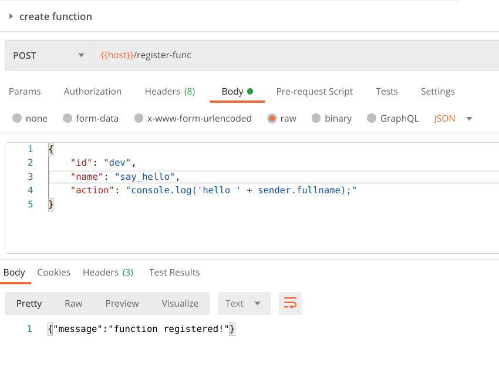
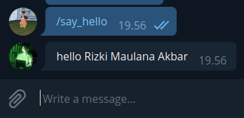

# Multi Account Telegram Bot

POC to prove we can register, listen and remove telegram bot on the fly.

## Setup
require: golang 1.15, node (for running custom function)

```
make dep
make run
```

## Sample Request

### Add new bot

```
curl --location --request POST 'http://localhost:8080/register' \
--header 'Content-Type: application/json' \
--data-raw '{
    "id": "your-bot-name",
    "token": "your-telegram-token'
```

### Register Custom Function

there are 2 variable that you use in js script:
- sender [js_object](username, fullname)
- payload [string]

```
curl --location --request POST 'http://localhost:8080/register-func' \
--header 'Content-Type: application/json' \
--data-raw '{
    "id": "your-bot-name",
    "name": "say_hello",
    "action": "console.log('\''hello '\'' + sender.fullname);"
}'
```

### Remove bot

```
curl --location --request DELETE 'http://localhost:8080/deregister' \
--header 'Content-Type: application/json' \
--data-raw '{
    "id": "your-bot-name"
}'
```

## Screenshot

### Register Custom Function



### Chat Custom Function


